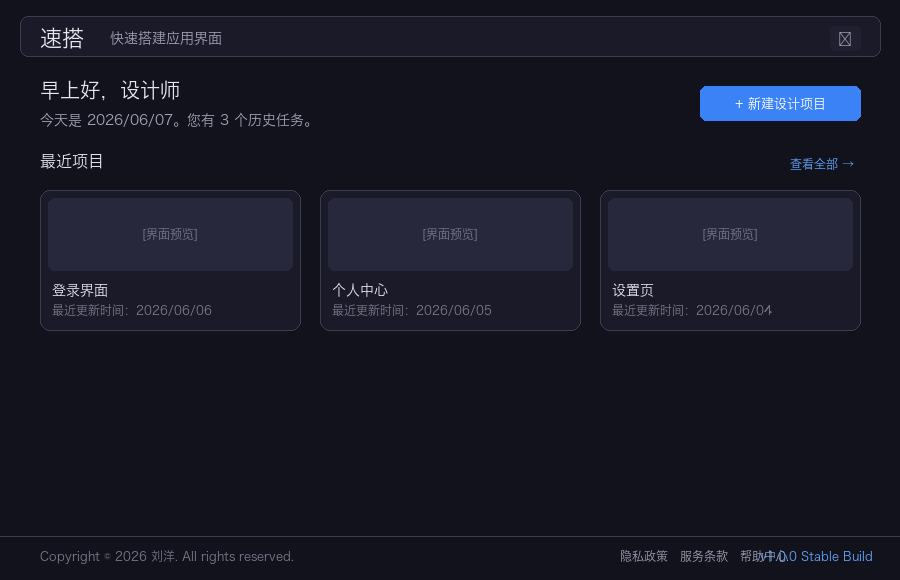
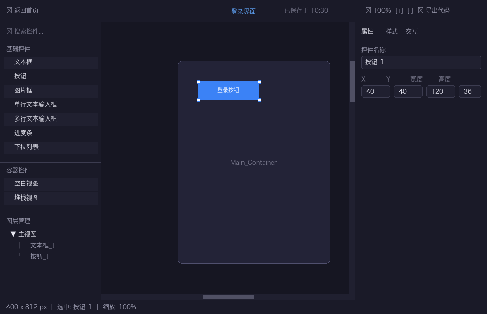
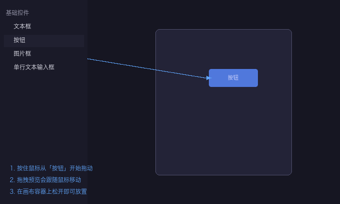
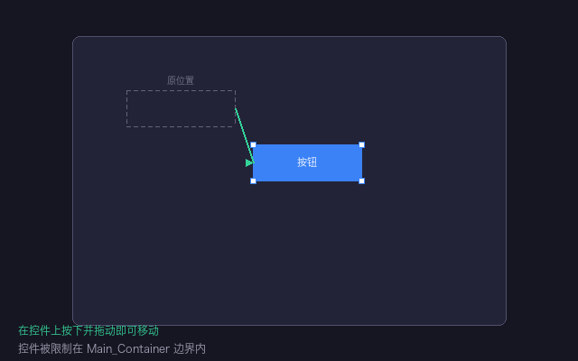
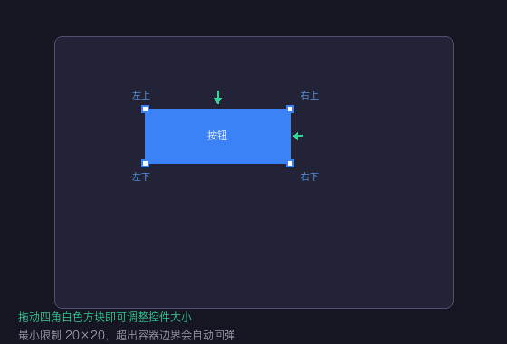
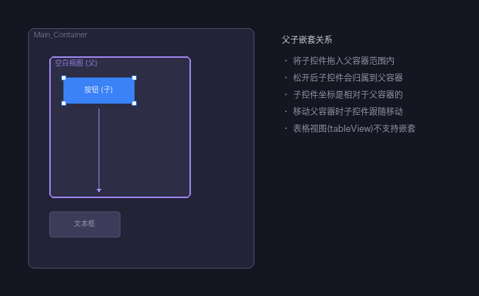
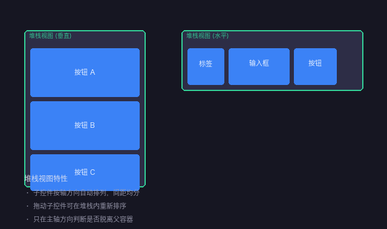
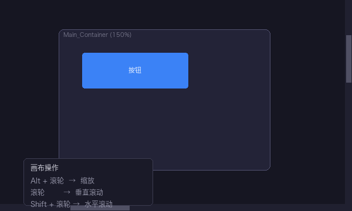

# 速搭 使用文档

> 速搭（Suda）是一款面向 iOS 开发的桌面级可视化界面搭建工具。通过拖拽组件、调整属性、导出代码三步，即可快速生成 Objective-C、Swift 或 SwiftUI 代码。

---

## 目录

1. [产品简介](#1-产品简介)
2. [首页与项目管理](#2-首页与项目管理)
3. [设计工作区总览](#3-设计工作区总览)
4. [组件库（左侧边栏）](#4-组件库左侧边栏)
5. [画布与拖动布局](#5-画布与拖动布局)
   - 5.1 [从组件库拖拽到画布](#51-从组件库拖拽到画布)
   - 5.2 [在画布上移动控件](#52-在画布上移动控件)
   - 5.3 [调整控件大小](#53-调整控件大小)
   - 5.4 [父子关系与嵌套](#54-父子关系与嵌套)
   - 5.5 [堆栈视图（StackView）特殊行为](#55-堆栈视图stackview特殊行为)
   - 5.6 [画布缩放与滚动](#56-画布缩放与滚动)
6. [属性面板（右侧边栏）](#6-属性面板右侧边栏)
7. [图层树](#7-图层树)
8. [菜单栏与导出代码](#8-菜单栏与导出代码)
9. [快捷键汇总](#9-快捷键汇总)

---

## 1. 产品简介

速搭的定位是「快速搭建应用界面」。它提供了一套完整的可视化设计环境：

- **可视化拖拽**：从左侧组件库拖拽控件到画布，所见即所得。
- **精细属性调节**：位置、尺寸、颜色、字体、边框、阴影、交互事件等均可配置。
- **父子嵌套**：支持容器嵌套，包括普通视图和堆栈视图（StackView）。
- **代码导出**：一键生成 Objective-C、Swift（UIKit）或 SwiftUI 代码，支持多种布局模式。

---

## 2. 首页与项目管理

打开应用后进入首页，这里管理你的所有设计项目。

### 主要功能

| 功能 | 说明 |
|------|------|
| **新建设计项目** | 点击右上角蓝色按钮，输入项目名称和画布尺寸（默认 375×812，标准 iPhone 尺寸）即可创建。 |
| **打开项目** | 点击项目卡片即可进入设计工作区。 |
| **删除项目** | 鼠标悬停在卡片上，右上角会出现删除按钮，确认后即可删除。 |
| **搜索项目** | 展开「查看全部」后，可在搜索框中按项目名称过滤。 |
| **设置** | 右上角齿轮图标进入设置页，可切换语言（中/英）和主题（深/浅）。 |

### 项目卡片

每个卡片显示：
- 界面缩略图（自动截取画布内容）
- 项目名称
- 最近更新时间

---

## 3. 设计工作区总览

点击项目卡片后进入设计工作区，这是速搭的核心编辑环境。

工作区由五个区域组成：

| 区域 | 位置 | 功能 |
|------|------|------|
| **菜单栏** | 顶部 | 返回首页、显示项目名称、保存状态、缩放控制、导出代码。 |
| **左侧边栏** | 左 | 组件库（可搜索、可拖拽）、图层管理树。 |
| **画布** | 中央 | 设计主区域，所有控件在此摆放。 |
| **右侧边栏** | 右 | 属性面板，编辑选中控件的属性、样式、交互。 |
| **状态栏** | 底部 | 显示画布尺寸、当前选中项、缩放比例。 |

> **深色/浅色主题**：工作区支持深色和浅色主题，可在设置中切换，所有面板、画布、控件均会自适应。

---

## 4. 组件库（左侧边栏）

左侧边栏上方是组件库，分为两大类：

### 基础控件

| 控件 | 用途 |
|------|------|
| **文本框** | 展示静态文本，支持多行、字体样式、对齐方式、省略模式。 |
| **按钮** | 可点击交互控件，支持标题、图标、背景图、多种状态（正常/高亮/禁用/选中）。 |
| **图片框** | 展示本地或网络图片，支持多种填充模式（缩放填充、等比适应、等比填充等）。 |
| **单行文本输入框** | 单行输入控件，支持占位符、清除按钮、键盘类型。 |
| **多行文本输入框** | 多行文本编辑，支持滚动、可编辑开关、字数限制。 |

### 容器控件

| 控件 | 用途 |
|------|------|
| **空白视图（View）** | 空容器，可作为其他控件的父容器，支持背景色、圆角、边框、阴影。 |
| **堆栈视图（StackView）** | 自动布局容器，子控件沿水平或垂直方向排列，自动处理间距和对齐。 |

### 使用方式

- **搜索**：在顶部搜索框输入关键词，按名称、描述或 ID 过滤组件。
- **查看说明**：鼠标悬停在组件上，右侧会弹出提示框，显示组件名称和详细说明。
- **拖拽使用**：按住组件项向画布拖动即可（详见下一节）。

---

## 5. 画布与拖动布局

画布是速搭最核心的交互区域。中央是 `Main_Container`（主视图容器），所有控件都必须放置在这个容器内。

### 5.1 从组件库拖拽到画布

**操作步骤：**

1. **按住组件**：在左侧组件库中，鼠标左键按住某个组件（如「按钮」）。
2. **拖拽预览**：一个半透明的组件预览会跟随鼠标移动，预览的大小和颜色与真实控件接近。
3. **放置到画布**：将预览拖到画布中央的 `Main_Container` 区域内，松开鼠标左键。
4. **完成添加**：控件会出现在你松开的位置，并自动被选中。

**注意事项：**

- 如果松开时不在 `Main_Container` 范围内，预览会以回弹动画返回组件库，表示放置失败。
- 如果松开位置与其他容器重叠，控件会作为子控件归属到该容器下（详见「父子嵌套」）。
- 
### 5.2 在画布上移动控件

**操作方式：**

1. **选中并拖动**：在画布上某个控件上按下鼠标左键并拖动，控件会跟随鼠标移动。
2. **边界限制**：控件被严格限制在 `Main_Container` 边界内。如果拖动到边缘，控件会被自动截断在边界上，不会超出容器。
3. **移动距离阈值**：拖动距离需超过 3 个逻辑像素才会触发真正的移动逻辑。如果只是轻微点击（< 3px），则视为选中操作。

**批量移动子控件：**

如果控件有子控件（嵌套关系），拖动父控件时，所有子控件会一起跟随移动。

### 5.3 调整控件大小

**操作方式：**

1. **先选中控件**：点击画布上的控件，使其处于选中状态。
2. **出现四角手柄**：选中后，控件四角会出现白色小方块（尺寸 8×8 像素）。
3. **拖动角手柄**：
   - **左上**：同时改变左上角位置、宽度和高度。
   - **右上**：改变右上角位置（Y 轴）、宽度和高度。
   - **右下**：只改变宽度和高度（最常用）。
   - **左下**：改变左下角位置（X 轴）、宽度和高度。

**限制规则：**

| 规则 | 说明 |
|------|------|
| 最小尺寸 | 宽度和高度均不能小于 20 像素。 |
| 边界回弹 | 调整大小时如果超出 `Main_Container` 边界，会自动回弹压缩，确保控件始终完全在容器内。 |
| 光标提示 | 鼠标悬停在角手柄上时，光标会变为对角拉伸样式（Windows）或移动样式（macOS）。 |

### 5.4 父子关系与嵌套

速搭支持控件的父子嵌套关系。任何容器控件（空白视图、堆栈视图）都可以包含子控件。

**如何建立父子关系：**

1. **从侧边栏拖入**：将新控件拖入某个容器控件的矩形范围内，松开后会自动成为该容器的子控件。
2. **在画布上拖入**：移动一个已存在的控件，使其完全进入另一个容器控件的范围内，松开后会自动变更父子关系。

**父子关系的行为：**

- **坐标相对性**：子控件的 X/Y 坐标是相对于父容器的左上角计算的。
- **跟随移动**：移动父容器时，所有子控件会一起跟随移动。
- **层级遮挡**：父容器会作为绘制边界，子控件超出父容器范围的部分默认会被裁剪（取决于 `clipToBounds` 设置）。
- **脱离父容器**：将子控件拖出父容器的范围后松开，如果完全不再重叠，子控件会脱离原父容器，变为 `Main_Container` 的直接子控件或归属到新的重叠容器下。

**限制：**

- - 系统会防止循环嵌套（A 嵌套 B，B 不能再嵌套 A）。

### 5.5 堆栈视图（StackView）特殊行为

堆栈视图（StackView）是一种特殊的自动布局容器，与普通空白视图不同：

**自动排列**：

- 子控件按照设定的轴方向（水平或垂直）自动排列。
- 支持多种分布方式：填充、等分填充、比例填充、等间距、等中心距。
- 支持多种对齐方式：填充、顶部/左侧、居中、底部/右侧、首行基线、末行基线。

**拖动重排序**：

- 在堆栈视图内拖动子控件，可以根据拖动方向自动重新排序。
- 系统会记录子控件在堆栈主轴方向上的中心点位置，松开后按新的位置顺序重新排列。

**脱离判断规则**：

- 对于堆栈视图，系统**只在主轴方向**判断是否脱离父容器。
- 例如：垂直堆栈视图中，子控件在水平方向上的偏移不会导致它脱离父容器；只有在垂直方向上完全移出范围才会脱离。

### 5.6 画布缩放与滚动

当设计复杂界面时，你可能需要放大查看细节或缩小查看全局。

**缩放操作：**

| 操作 | 效果 |
|------|------|
| `Alt + 鼠标滚轮` | 以鼠标指针位置为锚点进行缩放。向上滚动放大，向下滚动缩小。 |
| 顶部工具栏 | 菜单栏右侧有缩放百分比显示，可直接输入数值，或使用 `+` / `-` 按钮。 |

**滚动操作：**

| 操作 | 效果 |
|------|------|
| `鼠标滚轮` | 垂直滚动画布。 |
| `Shift + 鼠标滚轮` | 水平滚动画布。 |
| 拖动滚动条 | 画布右侧和底部分别有垂直/水平滚动条，可直接拖动。 |

> 画布会自动扩展以容纳所有内容，滚动区域只增不减，避免拖动时的跳动。

---

## 6. 属性面板（右侧边栏）

选中画布上的控件后，右侧边栏会显示该控件的属性。分为三个标签页：

### 属性标签

- **名称**：控件的标识名称，在图层树和代码中都会使用。系统会自动检测重名。
- **位置与尺寸**：
  - 对于 `Main_Container`：直接编辑 X、Y、宽度、高度。
  - 对于普通控件：显示相对于父容器的约束间距（上、左、下、右、水平居中、垂直居中），支持选择参考对象和关系类型。
- **内容**：根据控件类型显示不同字段：
  - 文本框：文本内容、占位符。
  - 图片框：图片路径。
  - 按钮：标题、图标、背景图（支持 4 种状态）。

> **约束自动清理**：如果同时设置了顶部间距和垂直居中，系统会自动清除冲突的约束，避免逻辑矛盾。

### 样式标签

| 分类 | 可配置项 |
|------|---------|
| **文字样式** | 颜色、字号、字重（UltraLight ~ Black）、最大行数、换行方式（自动换行/不换行/省略尾部/省略头部/省略中间/裁剪）、对齐方式（左/中/右）。 |
| **按钮专属** | 4 种状态下的标题颜色、标题文本、背景图、图标图，以及图标间距和图标位置（左/右/上/下）。 |
| **输入框专属** | 清除按钮模式、左右自定义视图及尺寸、键盘类型（默认/数字/URL/邮箱/电话等）。 |
| **多行文本专属** | 内容边距、文字边距、行首缩进。 |
| **图片专属** | 渲染模式（13 种 iOS 标准模式）、是否裁剪超出边界内容。 |
| **堆栈视图专属** | 轴方向（水平/垂直）、分布方式、对齐方式、间距。 |
| **通用外观** | 背景颜色、不透明度、圆角半径、边框宽度和颜色、阴影（颜色/不透明度/X 偏移/Y 偏移/模糊半径）。 |

### 交互标签

- **允许用户交互**：开关控件是否响应触摸事件。
- **多行文本专属**：是否可编辑、是否可滚动、是否可选中、最大输入长度。
- **按钮专属**：11 种控制事件开关（触摸按下、内部抬起、值改变、主操作触发等）。

> 属性修改是即时生效的，画布上的控件会实时更新。

---

## 7. 图层树

左侧边栏下半部分是图层树，以层级结构展示所有控件。

### 主要功能

- **查看层级**：根节点是「主视图」，下面按 zIndex 顺序排列所有子控件。有子控件的节点可以展开/折叠。
- **点击选中**：点击图层树中的节点，画布上对应的控件会被选中，右侧属性面板同步更新。
- **点击取消选中**：点击「主视图」根节点，取消所有选中状态。
- **长按拖动重排序**：长按某个节点并拖动，可以在同级之间改变顺序（zIndex）。
- **拖动改变父子关系**：将一个节点拖到另一个节点上，可以改变其父子归属。

### 图标与颜色

- 每个节点左侧有类型图标（蓝色），不同类型有不同的图标标识。
- 选中节点会有高亮背景。

---

## 8. 菜单栏与导出代码

顶部菜单栏提供项目级别的操作。

### 功能项

| 功能 | 说明 |
|------|------|
| **🏠 返回首页** | 回到项目列表页，当前项目会自动保存。 |
| **项目名称** | 中央蓝色文字显示当前项目名称，旁边显示最后一次保存时间。 |
| **缩放控制** | 显示当前缩放百分比（如 `100%`），可直接输入数值或点击 `+` / `-` 按钮。 |
| **📤 导出代码** | 打开导出对话框，将当前设计转换为代码。 |

### 导出代码

点击「导出代码」后，弹出配置对话框：

1. **选择语言**：
   - **Objective-C**：经典 iOS 开发语言。
   - **Swift**：Apple 现代编程语言（UIKit）。
   - **SwiftUI**：Apple 声明式 UI 框架。

2. **选择布局方式**（仅 Objective-C / Swift）：
   - **绝对布局（Frame）**：使用 `frame` 直接定位。
   - **原生约束（Auto Layout）**：使用 `NSLayoutConstraint` 锚点约束。
   - **第三方约束**：Masonry（Objective-C）或 SnapKit（Swift）。

3. **选择数据加载方式**（仅 Objective-C / Swift）：
   - **懒加载**：属性使用懒加载 getter 方法。
   - **直接赋值**：属性在 `init` / `setupSubviews` 中直接初始化。

4. **确认导出**：选择后会自动调用对应的代码生成服务，完成后弹出成功提示并显示导出文件路径。

> 系统会记住你上次的选择，下次打开导出对话框时会自动恢复。

---

## 9. 快捷键汇总

| 快捷键 | 作用 |
|--------|------|
| `Alt + 鼠标滚轮` | 以鼠标位置为锚点缩放画布 |
| `Shift + 鼠标滚轮` | 水平滚动画布 |
| `鼠标滚轮` | 垂直滚动画布 |
| `Delete` / `Backspace` | 删除当前选中的画布控件（焦点不在输入框内时生效） |
| `鼠标左键拖拽控件` | 移动控件 |
| `鼠标左键拖拽角手柄` | 调整控件大小 |
| `鼠标左键点击控件` | 选中控件 |
| `鼠标左键点击画布空白处` | 取消选中 |

---

## 附录：数据存储

所有项目数据均保存在本地存储（`localStorage`）中，包括：

- 项目元数据（名称、画布尺寸、创建/更新时间）
- 画布上所有控件的完整属性
- 父子层级关系
- 主视图的样式配置

你可以在「设置」→「存储内容」中查看所有项目的存储统计，包括项目总数、控件总数、本地存储占用大小，也可以在此清除数据。

---

*文档版本：v1.0.0*  
*最后更新：2026-06-07*
